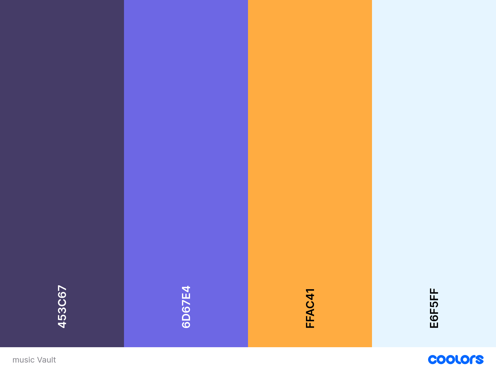

    
  
  # **Melody Vault**

  #### "Melody Vault" is a music platform showcasing a few of our favorite artists and a selection of their songs. It provides a simple, engaging experience for users to explore curated content and connect with the music we love. Users can dive into artist profiles, learn about their songs, and experience a personalized music journey crafted from our top picks.
  

  COLOR PALETTE            |  DEMO
:-------------------------:|:-------------------------:
   |  

## **KEY FEATURES:**
At the top of the webpage, there’s a navigation bar featuring three names. Each name links to two artists. When you click on an artist, the page updates to showcase three songs selected by the individuals in the navigation bar.
## **HOW TO USE (CLI)**
1. Clone the git repo (`git clone https://github.com/Fake4091/Unit-4-Project`)
2. Enter the folder (`cd Unit-4-Project`)
3. Install the dependencies (`npm i`)
4. Run the development server (`npm start`)
5. The page will open in your browser and you can stop the server by simply hitting ctrl+C in the terminal that is running the server.